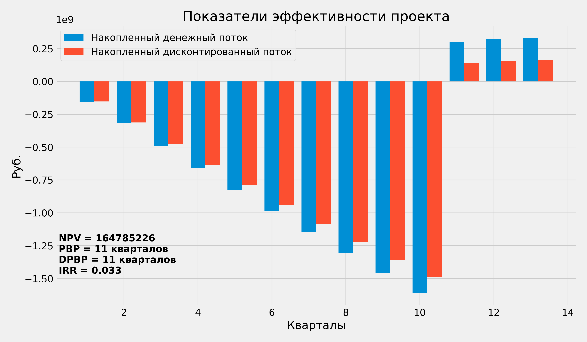

# Приложение для расчета показателей экономической эффективности проекта

Десктопное приложение, предназначенное для расчета показателей экономической эффективности проекта строительства жилого комплекса.

Исходные данные для расчета задаются пользователем при запуске программы и включают параметры, характеризующие проект (общая площадь и период строительства), удельные показатели стоимости (себестоимость в расчете на 1 кв. м общей площади здания, средняя цена продажи 1 кв. м квартир), ставку дисконтирования, ожидаемый уровень инфляции.

Окно пользовательского интерфейса создается стандартными средствами библиотеки tkinter. Для значений, вводимых в поля типа Entry, реализована проверка на корректность (допустимы только числовые значения без пробелов и знаков препинания).

По итогам работы программы рассчитываются основные показатели экономической эффективности проекта:
- NPV (Net Present Value - чистая приведенная стоимость проекта с учетом выбранной ставки дисконтирования)
- PBP (Payback Period - период окупаемости проекта)
- DPBP (Discounted Payback Period - дисконтированный период окупаемости проекта)
- IRR (Internal Rate of Return - внутренняя норма доходности проекта)

Расчет денежного потока производится в поквартальной динамике. График продаж квартир рассчитывается автоматически с учетом масштаба проекта, ценового класса и типичного распределения спроса по этапам реализации проекта. В расчет заложены допущения о том, что жилой комплекс массового ценового сегмента может быть продан за 2,5-3,5 года, верхней ценовой категории - за 3-4 года. Пик спроса приходится примерно на конец первой трети строительного цикла.

В расчете учитывается неравномерный рост цен на этапе строительства и после ввода жилого комплекса в эксплуатацию, а также ограничение, связанное с тем, что средства от продажи квартир становятся фактически доступны застройщику только после ввода объекта в эксплуатацию.

Программа не имеет ограничений на диапазон вводимых пользователем значений общей площади здания и продаваемой площади квартир. Однако в алгоритм заложено допущение о том, что крупные проекты реализуются очередями, и размер одной очереди не превышает 55 тыс. кв. м для проектов массового сегмента и 40 тыс. кв. м для проектов верхней ценовой категории. Более крупные проекты автоматически дробятся на очереди, и расчет экономических показателей производится для одной очереди.

Таблица с расчетными значениями денежного потока по кварталам и таблица, содержащая исходные данные и полученные оценки экономической эффективности, сохраняются в файл Excel.
