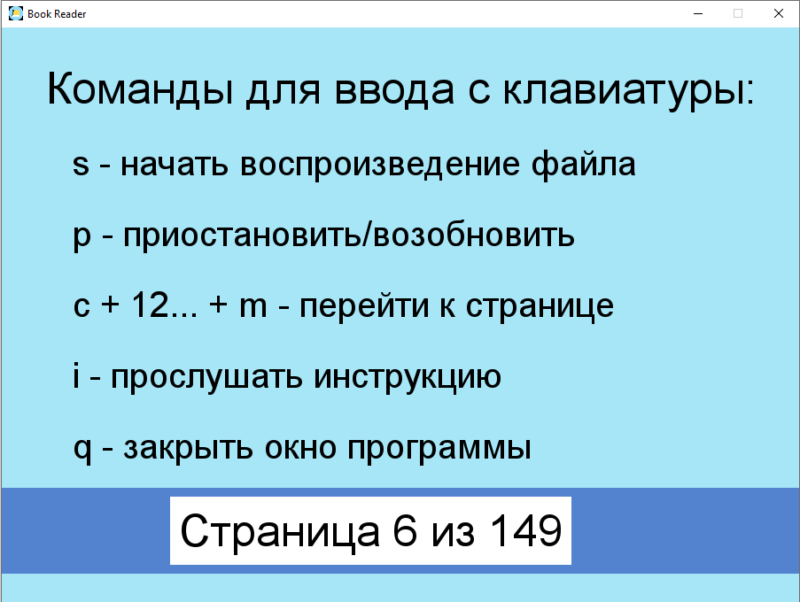

# Приложение для прослушивания текстовых файлов

Предназначено для воспроизведения в аудиоформате текстовых файлов, обладает функциональностью аудиоплейера (позволяет приостанавливать и возобновлять прослушивание текста, перемещаться к произвольно выбранной странице), запоминает текущую страницу файла, что позволяет при повторном запуске приложения возобновлять чтение с той же страницы (для хранения информации в долгосрочной памяти используется файл формата .json).

Преобразование текста в аудио осуществляется постранично, что позволяет обрабатывать крупные текстовые файлы и экономит ресурсы. Для файлов формата .txt под страницей понимается объем текста в 4000 знаков, что примерно соответствует одной странице pdf-файла с текстом без картинок. При работе плейера в текщей директории создается аудиофайл 'reader_audio.wav', содержащий текущую страницу документа.

Работа над приложением началась с идеи показать на несложном примере возможности различных библиотек для работы с текстовой информацией и аудиофайлами (pyttsx3, fitz). В процессе разработки было решено наполнить приложение функционалом, который сделает его удобным для людей, имеющих проблемы со зрением. Управление плейером осуществляется вводом команд с клавиатуры. Приложение оснащено аудиоподсказками для пользователя.

Основное окно программы содержит перечень ключевых команд и отображает текущую позицию плейера внутри текстового документа.

### Краткая инструкция для пользователей

- Запустите приложение.
- В открывшемся диалоговом окне выберите текстовый файл. Допустимые форматы: .txt, .pdf, .xps, .oxps, .epub, .cbz, .fb2.
- Дождитесь открытия основного окна программы (1-2 секунды в зависимости от объема документа). Окно содержит перечень основных команд для управления плейером. В нижней части окна расположен виджет, в котором отображается общее количество страниц в документе и номер текущей страницы.
- Управление плейером осуществляется вводом команд с клавиатуры (раскладка английская):
  - s - начать воспроизведение файла
  - p - приостановить/возобновить
  - c + 12... + m - перейти к странице
  - i - прослушать инструкцию
  - q - закрыть окно программы
- При первом запуске файла чтение начнется с первой страницы текстового документа. При последующих обращениях к тому же файлу чтение начнется с той страницы, на которой оно прервалось в предыдущий раз. При работе программы в текущей директории сохраняется файл 'reader_memory.json', который содержит словарь ссылок на прослушиваемые файлы с номерами текущей страницы для каждого файла. При прослушивании файла до последней страницы ссылка на этот файл удаляется из памяти ридера, и при повторном обращении к файлу чтение начнется с первой страницы.
- При воспроизведении текстового файла переход к следующей странице производится автоматически.
- Двукратное нажатие клавиши p приостанавливает чтение текста и возобновляет его с того же самого места, на котором было прервано.
- Если нажать клавишу p для остановки чтения файла и затем нажать клавишу s, чтение возобновится с начала текущей страницы документа.
- Чтобы изменить номер текущей страницы, остановите воспроизведение файла и нажмите клавишу c. Введите нужный номер страницы и проверьте, что он корректно отображается в нижней части окна. Ошибочно введенное число можно отменить клавишей Backspace. Завершив ввод, нажмите клавишу m - чтение возобновится с указанной страницы.
