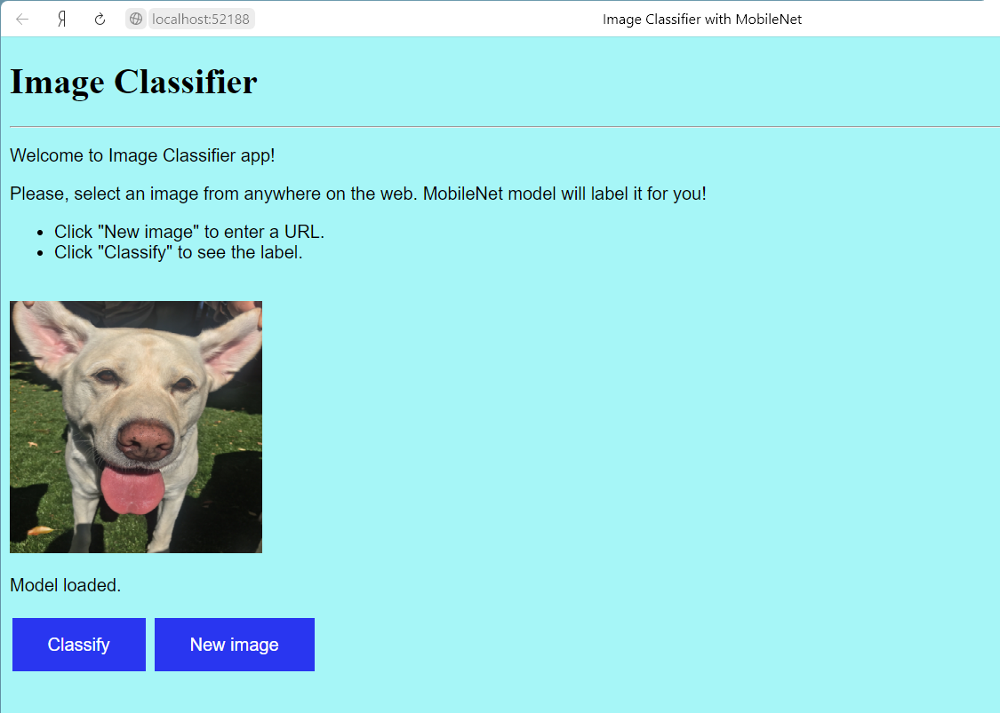
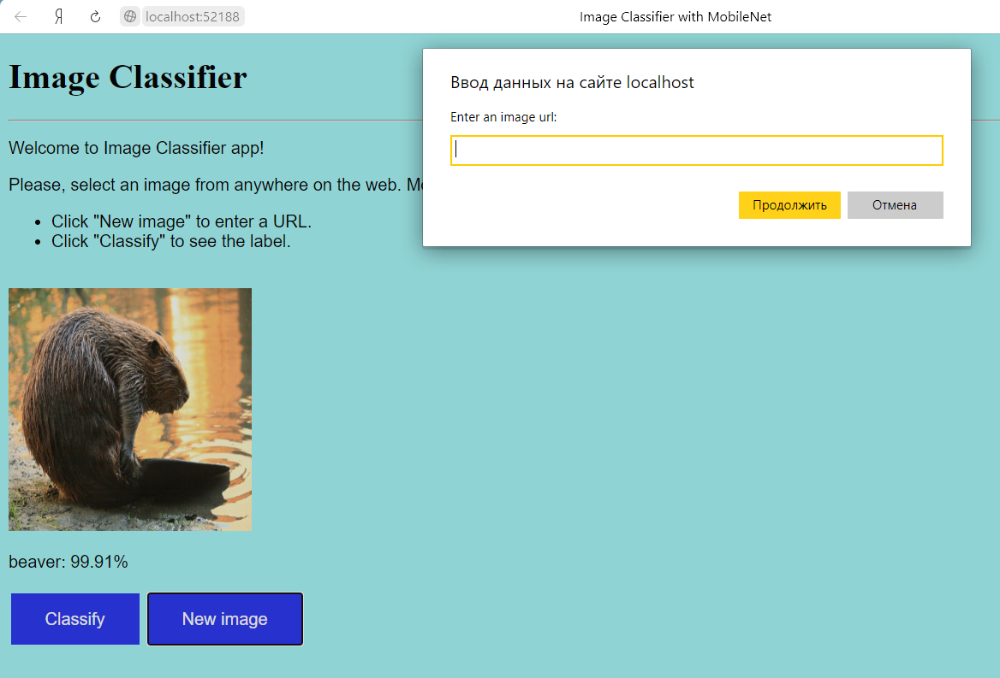

# Веб-приложение для классификации изображений

Пример использования готовой модели MobileNet для классификации изображений в интенет-браузере.

Приложение включает в себя два модуля:
- Файл HTML для запуска в браузере на локальном компьютере пользователя.
- Файл .js, отвечающий за обработку вводимых пользователем url-ссылок, классификацию изображений и отображение результатов.

В основе лежит готовая модель MobileNet, скачиваемая по ссылке в формате, пригодном для работы через JavaScript. Модель не переобучалась и используется в базовом варианте.

При запуске приложения в браузере отображается графический интерфейс с инструкциями для пользователя и .jpg файл, загружаемый по умолчанию.

Для загрузки модели требуется несколько секунд. При переходе от загрузки к ожиданию пользовательских команд подпись под изображением "Loading model..." сменяется подписью "Model loaded."

После этого при нажатии на кнопку "Classify" под изображением появляется наименование (класс) объекта и вероятность в процентах.

При нажатии на кнопку "New image" появляется всплывающее окно, позволяющее пользователю ввести url-ссылку на любое изображение.

Предупреждение: не все интернет-страницы позволяют копировать и отображать содержимое таким образом.
Алгоритм работает, только если на стороннем сайте, который укажет пользователь, не задано никаких ограничений.
При возникновении проблем (картинка не отображается в браузере) рекомендуется скачать интересующее изображение на локальный компьютер и указать во всплывающем окне ссылку на локальный файл.

Для тестирования модели можно также использовать ссылки на изображения с сайта https://imgur.com, они не содержат ограничений.

Принимая во внимание характеристики модели MobileNet, алгоритм наиболее эффективен для классификации изображений, на которых представлен один объект, находящийся на переднем плане. 
При классификации изображений с несколькими объектами, нечетких изображений или объектов на дальнем плане погрешность оценок возрастает.
