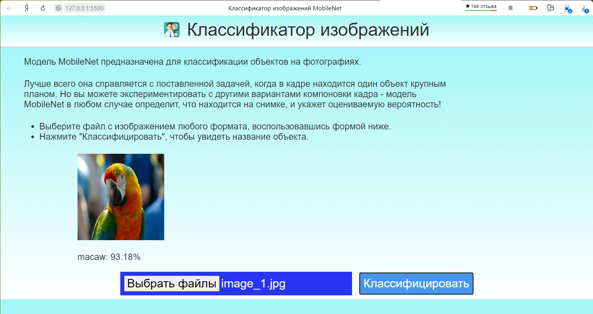
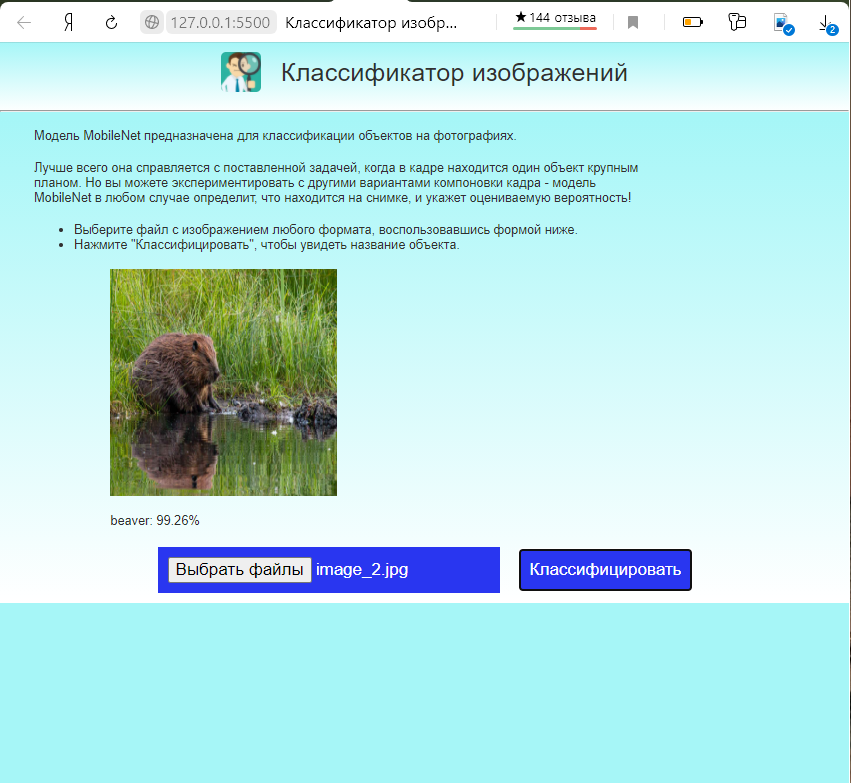

# Веб-приложение для классификации изображений

Пример использования готовой модели MobileNet для классификации изображений в интенет-браузере.

Приложение включает в себя 3 модуля:
- Файл HTML для запуска в браузере на локальном компьютере пользователя.
- Файл .css с параметрами форматирования элементов HTML-страницы.
- Файл .js, отвечающий за обработку выбранных пользователем изображений.

В основе лежит готовая модель MobileNet, скачиваемая по ссылке в формате, пригодном для работы через JavaScript. Модель не переобучалась и используется в базовом варианте.

При запуске приложения в браузере отображается графический интерфейс с инструкциями для пользователя и .jpg файл, загружаемый по умолчанию по внешней ссылке.

Для загрузки модели требуется несколько секунд. При переходе от загрузки к ожиданию пользовательских команд подпись под изображением "Идет загрузка модели..." сменяется подписью "Модель загружена."

После этого при нажатии на кнопку "Классифицировать" под изображением появляется наименование (класс) объекта и вероятность в процентах.

При нажатии на кнопку "Выбрать файлы" появляется всплывающая форма, позволяющая пользователю выбрать файл с изображением на локальном устройстве. Изображение из выбранного файла автоматически загружается на страницу.

Элементы HTML-страницы отформатированы таким образом, что размеры шрифтов и основных элементов подстраиваются под размеры окна браузера, что потенциально позволяет использовать это приложение на любых устройствах.

Принимая во внимание характеристики модели MobileNet, алгоритм наиболее эффективен для классификации изображений, на которых представлен один объект, находящийся на переднем плане. При классификации изображений с несколькими объектами, нечетких изображений или объектов на дальнем плане погрешность оценок возрастает.
