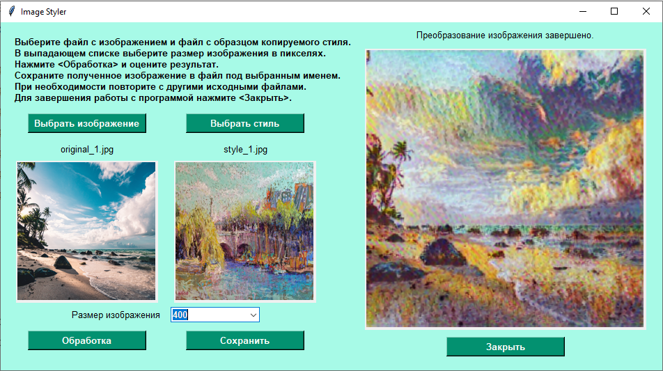

# Приложение на основе модели Neural Style Transfer

В основе алгоритма - готовая модель, представленная на TensorFlow Hub:

https://tfhub.dev/google/magenta/arbitrary-image-stylization-v1-256/2

Модель позволяет перенести стиль с одного из двух произвольно выбранных изображений на другое.

Приложение реализовано в десктопной версии с интерфейсом tkinter.

Функционал приложения позволяет пользователю выбирать с локального компьютера файлы с исходным изображением и образцом копируемого стиля, желаемый размер в пикселях, видеть исходные данные и результат трансформации в окне пользовательского интерфейса, сохранять полученное изображение в файл.
